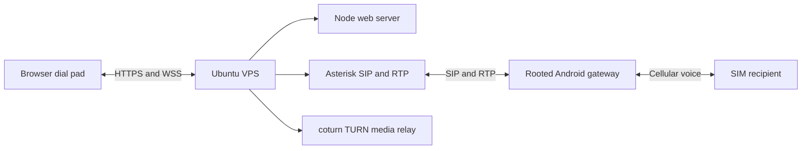

# GSM2SIP Deployment Manual

This manual explains how to deploy the complete GSM2SIP system for someone
who is setting it up for the first time.

The system has three parts:

1. **Web application and Node server**: serves the browser dial pad and gives
   the browser its SIP configuration.
2. **Asterisk**: handles SIP signaling and connects the browser to the Android
   gateway.
3. **Android gateway**: uses the phone's SIM card to place or receive the
   cellular call and bridges the audio to SIP.

The recommended deployment puts the web server, Asterisk, and coturn on one
public VPS. The Android phone is a separate device connected to the same SIP
server over the network.



## 1. What you need before starting

Prepare the following:

- A VPS with Ubuntu 24.04 LTS or Debian 12.
- At least 2 vCPU, 4 GB RAM, and 40 GB SSD for a small installation.
- A public static IPv4 address.
- Root or sudo access to the VPS.
- A domain name that you control.
- A dedicated Android phone with its prepared SIM and gateway software.
- The SIP username and password for the browser.
- The SIP username and password for the Android gateway.
- A long random TURN username and password.

For more simultaneous calls, use 4 vCPU and 8 GB RAM. TURN traffic can also
increase bandwidth usage because media may pass through the VPS.

Do not use shared hosting, serverless hosting, or a VPS that blocks SIP/UDP
traffic. The server needs long-running processes, WebSockets, UDP, and custom
firewall rules.

## 2. Choose names and addresses

Use separate DNS names even when all services run on one VPS:

| Name | Purpose |
| --- | --- |
| `web.example.com` | Browser web application and HTTPS |
| `sip.example.com` | Asterisk SIP/WSS address |
| `turn.example.com` | coturn TURN address |

Create `A` records pointing to the VPS public IPv4 address:

```text
web.example.com   A   <VPS_PUBLIC_IP>
sip.example.com   A   <VPS_PUBLIC_IP>
turn.example.com  A   <VPS_PUBLIC_IP>
```

Wait until DNS resolves before requesting TLS certificates:

```bash
dig +short web.example.com
dig +short sip.example.com
dig +short turn.example.com
```

Each command should return the VPS public IP.

## 3. Configure the VPS firewall

First connect to the server and update it:

```bash
ssh <VPS_USER>@<VPS_PUBLIC_IP>
sudo apt update
sudo apt upgrade -y
```

Install the basic tools:

```bash
sudo apt install -y git curl ca-certificates unzip ufw nginx certbot python3-certbot-nginx
```

Configure the firewall. Replace `<YOUR_IP>` with your own fixed IP if you
want to restrict SSH access.

```bash
sudo ufw default deny incoming
sudo ufw default allow outgoing
sudo ufw allow from <YOUR_IP> to any port 22 proto tcp
sudo ufw allow 80/tcp
sudo ufw allow 443/tcp
sudo ufw allow 3478/tcp
sudo ufw allow 3478/udp
sudo ufw allow 5349/tcp
sudo ufw allow 5349/udp
sudo ufw allow 8089/tcp
sudo ufw allow 5060/udp
sudo ufw allow 5061/tcp
sudo ufw allow 49152:65535/udp
sudo ufw enable
sudo ufw status verbose
```

Port notes:

- `80` and `443`: web access and certificate renewal.
- `8089`: Asterisk WebSocket Secure endpoint for the browser.
- `5060` or `5061`: SIP traffic used by the Android gateway, depending on the
  selected transport.
- `3478` and `5349`: coturn.
- `49152-65535/udp`: coturn relay media.

Also open the same ports in the VPS provider's cloud firewall/security group.

## 4. Install Node.js and download the project

Install Node.js 20 or newer:

```bash
curl -fsSL https://deb.nodesource.com/setup_20.x | sudo -E bash -
sudo apt install -y nodejs
node --version
npm --version
```

Download the project:

```bash
sudo mkdir -p /opt/web2phone
sudo chown "$USER":"$USER" /opt/web2phone
git clone <REPOSITORY_URL> /opt/web2phone
cd /opt/web2phone/server
npm ci --omit=dev
```

If the project is uploaded manually instead of using Git, copy the complete
repository to `/opt/web2phone` and run the same `npm ci` command.

## 5. Create the Node environment file

Create the real environment file from the template:

```bash
cd /opt/web2phone/server
cp .env.example .env
chmod 600 .env
nano .env
```

For the recommended nginx setup, use these values:

```dotenv
NODE_ENV=production
WEB_HOST=127.0.0.1
PORT=3000

SIP_DOMAIN=sip.example.com
SIP_WS_URL=wss://sip.example.com:8089/ws
SIP_USERNAME=webuser
SIP_PASSWORD=<WEB_SIP_PASSWORD>

STUN_SERVER_URLS=stun:stun.l.google.com:19302
TURN_SERVER_URLS=turn:turn.example.com:3478,turns:turn.example.com:5349
TURN_USERNAME=<TURN_USERNAME>
TURN_PASSWORD=<TURN_PASSWORD>
```

Leave `HTTPS_KEY_PATH` and `HTTPS_CERT_PATH` unset when nginx terminates TLS.
Node will listen on local HTTP port 3000, and nginx will provide public HTTPS.

Important:

- `SIP_DOMAIN` must match the Asterisk public name and certificate name.
- `SIP_WS_URL` must point to Asterisk, not the Node server.
- `SIP_USERNAME` and `SIP_PASSWORD` are the browser's Asterisk account.
- The password is sent to the browser because SIP.js needs it. Use a dedicated
  SIP account and do not reuse an administrator password.
- The Android gateway uses its own SIP account and should not reuse `webuser`.

## 6. Install and configure Asterisk

Install Asterisk:

```bash
sudo apt install -y asterisk
sudo systemctl enable --now asterisk
sudo asterisk -rx 'core show version'
```

The repository contains templates at:

- `server/asterisk/pjsip.conf.example`
- `server/asterisk/extensions.conf.example`

Back up existing files before editing:

```bash
sudo cp /etc/asterisk/pjsip.conf /etc/asterisk/pjsip.conf.backup 2>/dev/null || true
sudo cp /etc/asterisk/extensions.conf /etc/asterisk/extensions.conf.backup 2>/dev/null || true
```

Copy the examples and edit them:

```bash
sudo cp /opt/web2phone/server/asterisk/pjsip.conf.example /etc/asterisk/pjsip.conf
sudo cp /opt/web2phone/server/asterisk/extensions.conf.example /etc/asterisk/extensions.conf
sudo nano /etc/asterisk/pjsip.conf
sudo nano /etc/asterisk/extensions.conf
```

### 6.1 Browser SIP account

In `[web-auth]`, set the same values as the Node environment:

```ini
[web-auth]
type=auth
auth_type=userpass
username=webuser
password=<WEB_SIP_PASSWORD>
```

The browser endpoint must use WSS and WebRTC:

```ini
[web-endpoint]
type=endpoint
aors=web-aor
auth=web-auth
context=from-web
transport=transport-wss
webrtc=yes
disallow=all
allow=opus,ulaw,alaw,g722
direct_media=no
rtp_symmetric=yes
force_rport=yes
rewrite_contact=yes
ice_support=yes
media_encryption=dtls
```

### 6.2 Android gateway SIP account

In `[gateway-auth]`, choose a separate password:

```ini
[gateway-auth]
type=auth
auth_type=userpass
username=gateway
password=<ANDROID_SIP_PASSWORD>
```

Configure the Android app with:

```text
SIP server: sip.example.com
SIP port: 5060
SIP username: gateway
SIP password: <ANDROID_SIP_PASSWORD>
```

The example uses UDP for the Android gateway and WSS for the browser.

### 6.3 Enable Asterisk WebSocket support

Check the installed modules:

```bash
sudo asterisk -rx 'module show like res_http_websocket'
sudo asterisk -rx 'http show status'
```

Enable the Asterisk HTTP server in `/etc/asterisk/http.conf`:

```ini
[general]
enabled=yes
bindaddr=0.0.0.0
bindport=8088
```

Configure Asterisk TLS certificates according to the installed Asterisk
version. The certificate must cover `sip.example.com`.

Restart and inspect Asterisk:

```bash
sudo systemctl restart asterisk
sudo asterisk -rx 'http show status'
sudo asterisk -rx 'pjsip show transports'
sudo asterisk -rx 'pjsip show endpoints'
```

The browser must use a trusted certificate. Self-signed certificates will be
rejected unless they are installed as trusted on every client device.

### 6.4 Install the dialplan

The example dialplan supports both required directions:

- Browser outbound call: Asterisk adds `X-GSM-Forward` and sends the call to
  the Android gateway.
- GSM inbound call: Asterisk sends the call to the browser endpoint.

The important outbound route is:

```asterisk
[from-web]
exten => _X.,1,NoOp(Outbound browser call to ${EXTEN})
 same => n,Set(DIAL_TARGET=${EXTEN})
 same => n,Set(CALLERID(all)="Web Dial Pad" <webuser>)
 same => n,Dial(PJSIP/gateway-endpoint,60,b(gsm-forward^s^1(${DIAL_TARGET})))
 same => n,Hangup()

[gsm-forward]
exten => s,1,Set(PJSIP_HEADER(add,X-GSM-Forward)=${ARG1})
 same => n,Return()
```

The Android gateway reads `X-GSM-Forward` and dials the destination through
the SIM. If your country requires a prefix or number normalization, add it in
the dialplan before setting `DIAL_TARGET`.

Reload after changes:

```bash
sudo asterisk -rx 'dialplan reload'
sudo asterisk -rx 'pjsip reload'
sudo asterisk -rx 'dialplan show from-web'
```

## 7. Install coturn for browser media

Install coturn:

```bash
sudo apt install -y coturn
```

Enable it:

```bash
sudo sed -i 's/^#TURNSERVER_ENABLED=1/TURNSERVER_ENABLED=1/' /etc/default/coturn
```

Create `/etc/turnserver.conf`:

```ini
listening-port=3478
tls-listening-port=5349
listening-ip=<VPS_PUBLIC_IP>
relay-ip=<VPS_PUBLIC_IP>
external-ip=<VPS_PUBLIC_IP>
realm=turn.example.com
server-name=turn.example.com
fingerprint
lt-cred-mech
user=<TURN_USERNAME>:<TURN_PASSWORD>
cert=/etc/letsencrypt/live/turn.example.com/fullchain.pem
pkey=/etc/letsencrypt/live/turn.example.com/privkey.pem
min-port=49152
max-port=65535
no-cli
no-tlsv1
no-tlsv1_1
```

If the VPS provider uses private/public NAT, follow its NAT format for
`external-ip`, usually `<PUBLIC_IP>/<PRIVATE_IP>`.

Start and inspect coturn:

```bash
sudo systemctl enable --now coturn
sudo systemctl status coturn
sudo journalctl -u coturn -n 50 --no-pager
```

TURN is a fallback for restrictive networks. The browser uses direct media or
STUN when possible, then TURN when necessary.

## 8. Create HTTPS certificates

Request the web certificate after DNS is working:

```bash
sudo certbot --nginx -d web.example.com
sudo certbot renew --dry-run
```

The Asterisk and coturn names are not nginx sites in this guide, so request
their certificates separately with your DNS provider's DNS challenge, or use a
temporary standalone/webroot certificate method. For example, with a Certbot
DNS plugin:

```bash
sudo certbot certonly --dns-<YOUR_PROVIDER> \
  -d sip.example.com -d turn.example.com
```

Install the resulting certificate and key paths in the Asterisk and coturn
configuration. Do not use the web certificate paths for those services unless
the certificate also contains their names.

The web application must use HTTPS because browsers do not allow microphone
access from an ordinary remote HTTP page. WSS also requires a trusted TLS
certificate.

## 9. Configure nginx for Node

Create `/etc/nginx/sites-available/web2phone`:

```nginx
server {
    listen 80;
    server_name web.example.com;
    return 301 https://$host$request_uri;
}

server {
    listen 443 ssl http2;
    server_name web.example.com;

    ssl_certificate /etc/letsencrypt/live/web.example.com/fullchain.pem;
    ssl_certificate_key /etc/letsencrypt/live/web.example.com/privkey.pem;

    location / {
        proxy_pass http://127.0.0.1:3000;
        proxy_http_version 1.1;
        proxy_set_header Host $host;
        proxy_set_header X-Real-IP $remote_addr;
        proxy_set_header X-Forwarded-For $proxy_add_x_forwarded_for;
        proxy_set_header X-Forwarded-Proto $scheme;
    }
}
```

Enable and test it:

```bash
sudo ln -s /etc/nginx/sites-available/web2phone /etc/nginx/sites-enabled/web2phone
sudo nginx -t
sudo systemctl reload nginx
```

Do not expose Node port 3000 publicly. Node should listen only on
`127.0.0.1`.

## 10. Run Node with systemd

Create a service account:

```bash
sudo useradd --system --home /opt/web2phone --shell /usr/sbin/nologin web2phone
sudo chown -R web2phone:web2phone /opt/web2phone/server
sudo chmod 600 /opt/web2phone/server/.env
```

Create `/etc/systemd/system/web2phone.service`:

```ini
[Unit]
Description=web2phone browser gateway
After=network-online.target
Wants=network-online.target

[Service]
Type=simple
WorkingDirectory=/opt/web2phone/server
ExecStart=/usr/bin/node /opt/web2phone/server/server.js
Restart=on-failure
RestartSec=5
User=web2phone
Group=web2phone
Environment=NODE_ENV=production

[Install]
WantedBy=multi-user.target
```

Start it:

```bash
sudo systemctl daemon-reload
sudo systemctl enable --now web2phone
sudo systemctl status web2phone
```

View Node logs:

```bash
sudo journalctl -u web2phone -f
```

## 11. Build and configure the Android gateway

The Android gateway is the dedicated phone that converts SIP calls into calls
through the phone's local SIM. It must be prepared before the web dialer can
make cellular calls.

### 11.1 Android gateway requirements

Prepare:

- A rooted Android phone supported by the project.
- A working SIM with a voice plan.
- Magisk installed on the phone.
- Reliable Wi-Fi or mobile data access to the VPS.
- The Android SIP username and password created in Asterisk.
- The phone's own SIM number in international format.
- A USB cable and ADB access for installation and debugging.

The audio bridge depends on the phone's vendor audio implementation. Hardware
compatibility is outside the VPS setup, but the phone still needs to be
prepared as a privileged gateway device.

### 11.2 Build prerequisites

The Android build scripts expect a Debian or Ubuntu build machine with:

- JDK 17 or newer.
- Android SDK command-line tools.
- Android platform 34 and build-tools 34.0.0.
- Gradle wrapper 8.5.
- Go, if the architecture-specific `tinymix` binaries need to be rebuilt.
- ADB for optional installation to a connected phone.

From the repository's `Android` directory, run the setup script on a Debian or
Ubuntu build machine:

```bash
cd /path/to/web2phone/Android
chmod +x setup.sh build.sh gradlew
sudo ./setup.sh
source .env.build
```

The setup script installs the Android SDK under `/opt/android-sdk`, accepts
SDK licenses, installs the required SDK packages, creates `local.properties`,
and prepares the Gradle wrapper.

Do not run the build as root after setup. Use your normal build user.

### 11.3 Build the APK and Magisk module

Build a debug package for testing:

```bash
cd /path/to/web2phone/Android
source .env.build
SKIP_INSTALL=1 ./build.sh
```

Build a release package for delivery:

```bash
SKIP_INSTALL=1 ./build.sh release
```

The script creates:

```text
Android/gateway.apk
Android/gateway-magisk.zip
```

The Magisk ZIP includes the APK as a privileged system application and includes
the architecture-specific audio tools. `tinymix` must match the phone's ABI;
the build script creates both arm64 and armeabi-v7a variants when Go is
available.

To install the APK directly for development when one phone is connected:

```bash
adb devices
adb -s <ANDROID_SERIAL> install -r gateway.apk
```

For the intended privileged installation, copy `gateway-magisk.zip` to the
phone, install it from Magisk, and reboot the phone. The Magisk module is
required for the privileged telephony/audio permissions and mixer changes used
by the bridge.

### 11.4 Prepare the Android phone

On the phone:

1. Install the `gateway-magisk.zip` module in Magisk.
2. Reboot after Magisk finishes installation.
3. Open the web2phone application once while the screen is unlocked.
4. Grant microphone, phone, notification, and other requested permissions.
5. Set web2phone as the default phone application:
  `Settings -> Apps -> Default apps -> Phone app`.
6. Allow notifications so the foreground service can display its persistent
  status notification.
7. Disable battery optimization for web2phone.
8. Keep the phone connected to power and stable network access.

The app contains an `InCallService` and a `ConnectionService`. Setting it as the
default phone application is required for Android to deliver GSM call events
to the gateway reliably.

### 11.5 Configure the Android SIP connection

Open the Android app's Settings screen and enter values matching Asterisk:

```text
SIP server: sip.example.com
SIP port: 5060
SIP username: gateway
SIP password: <ANDROID_SIP_PASSWORD>
Own SIM number: +<COUNTRY_CODE><NUMBER>
```

The own SIM number is important for inbound routing. If Android cannot read it
from the SIM, enter it manually in international format.

Use the codec settings supported by both Asterisk and the device. The project
prefers G.722 and can fall back to PCMA or PCMU when configured. The Asterisk
gateway endpoint in `pjsip.conf` allows:

```ini
disallow=all
allow=g722,ulaw,alaw
```

Start the gateway service from the app. The Android status indicator should
show that SIP registration is online.

### 11.6 Confirm Android registration in Asterisk

On the VPS:

```bash
sudo asterisk -rvvv
pjsip show contacts
pjsip show endpoint gateway-endpoint
```

The gateway contact should be present and reachable. If it is not present,
check the Android server address, port, username, password, network, and the
Asterisk firewall.

The Android service automatically maintains SIP registration, reconnects when
the network changes, and keeps the SIP client alive as a foreground service.

### 11.7 Verify the Android call flows

Test outbound first:

1. Open `https://web.example.com` in a browser.
2. Sign in using the hardcoded web login.
3. Wait for the browser SIP indicator to show **Online**.
4. Dial a test mobile number.
5. Confirm Asterisk sends an INVITE to `gateway-endpoint` with
  `X-GSM-Forward`.
6. Confirm Android changes to GSM dialing.
7. Answer the test phone and verify two-way audio.
8. Hang up from the browser and confirm the cellular call ends.

Test inbound next:

1. Call the Android SIM from another phone.
2. Confirm Android receives the GSM call.
3. Confirm Android places a SIP call to the configured destination.
4. Answer in the browser or SIP endpoint.
5. Confirm Android answers the GSM leg only after the SIP side answers.
6. Confirm two-way audio and hang-up in both directions.

Monitor the Android service with ADB when diagnosing a call:

```bash
adb -s <ANDROID_SERIAL> logcat -c
adb -s <ANDROID_SERIAL> logcat | grep -E 'GatewayService|CallOrchestrator|SipClient|RtpSession'
```

### 11.8 Android troubleshooting

### The gateway does not register

- Confirm Asterisk shows the `gateway` endpoint and auth credentials.
- Confirm the SIP server is `sip.example.com`, not `web.example.com`.
- Confirm UDP port 5060 is reachable from the phone's network.
- Check the Android service log and Asterisk console.

### The phone receives a call but it is not bridged

- Confirm web2phone is the default phone application.
- Reopen the app once after reboot.
- Confirm the own SIM number is configured correctly.
- Confirm the Asterisk inbound dialplan routes the SIM number.

### The browser call reaches Android but the phone does not dial

- Confirm the INVITE contains `X-GSM-Forward`.
- Confirm the number is a valid dialable number.
- Confirm Android has phone-call permissions.
- Confirm the gateway is not already busy with another call.

### There is no audio or audio is one-way

- Confirm the Magisk module was installed and the phone was rebooted.
- Confirm RTP ports are open on the VPS.
- Confirm coturn is configured if the browser is behind restrictive NAT.
- Confirm the selected codec is allowed by Asterisk.
- Inspect `RtpSession` messages with ADB logcat.

### The service stops in the background

- Disable battery optimization for web2phone.
- Allow notifications.
- Keep the app as the default phone application.
- Start the foreground service once while the app is visible.
- Confirm the persistent gateway notification remains present.

### Calls loop back or never answer

The own SIM number is probably missing or incorrect. The gateway uses the own
number to avoid addressing its own SIP account when routing inbound calls.

## 12. Verify the complete deployment

Run these checks from the VPS:

```bash
curl -fsS https://web.example.com/api/health
curl -fsS https://web.example.com/api/ready
curl -fsS https://web.example.com/api/settings
```

Expected health properties include:

```json
{
  "ok": true,
  "configured": true
}
```

Open:

```text
https://web.example.com
```

Use the hardcoded application login, then confirm:

1. The SIP connection indicator becomes **Online**.
2. Microphone permission is granted.
3. Menu shows the correct web, SIP, Asterisk, and TURN values.
4. Asterisk shows both browser and Android contacts.
5. Dialing a number makes Asterisk send `X-GSM-Forward` to Android.
6. Android places the cellular call through the SIM.
7. Two-way audio works.
8. Browser hang-up ends both SIP and GSM calls.
9. Hanging up from the cellular side ends the browser call.

Watch logs during the first call:

```bash
sudo journalctl -u web2phone -f
sudo asterisk -rvvv
sudo journalctl -u coturn -f
```

## 13. Troubleshooting

### The web page does not open

```bash
sudo systemctl status nginx
sudo systemctl status web2phone
sudo nginx -t
curl -I https://web.example.com
```

Common causes are incorrect DNS, missing certificates, port 443 blocked, or
Node not running on port 3000.

### `/api/health` says `configured: false`

```bash
sudo -u web2phone cat /opt/web2phone/server/.env
sudo systemctl restart web2phone
sudo journalctl -u web2phone -n 50 --no-pager
```

The required values are `SIP_DOMAIN`, `SIP_WS_URL`, `SIP_USERNAME`, and
`SIP_PASSWORD`.

### Browser stays offline

Check that:

- `SIP_WS_URL` uses `wss://`, not `ws://`.
- `sip.example.com` has a trusted certificate.
- Asterisk HTTP/WebSocket support is enabled.
- Port 8089 is open.
- Browser endpoint credentials match `.env`.

```bash
sudo asterisk -rx 'http show status'
sudo asterisk -rx 'pjsip show endpoint web-endpoint'
sudo ss -lntup | grep -E '3000|5060|8088|8089'
```

### Android is not registered

Check the Android SIP server, port, username, and password:

```bash
sudo asterisk -rx 'pjsip show contacts'
sudo asterisk -rx 'pjsip show endpoint gateway-endpoint'
```

If Android is behind NAT, confirm `rewrite_contact=yes` and `rtp_symmetric=yes`.

### The call connects but there is no audio

Check:

- Asterisk RTP port range and VPS firewall rules.
- coturn relay range `49152-65535/udp`.
- `external-ip` in `/etc/turnserver.conf`.
- Asterisk `direct_media=no`.
- Browser WebRTC ICE candidates.
- Android RTP logs and codec compatibility.

The browser and Android gateway must negotiate a codec both sides support. The
templates include G.722, PCMU, and PCMA.

### Browser dials but Android does not place the cellular call

Check the Asterisk console for the outgoing INVITE and verify it contains
`X-GSM-Forward`. Confirm Android is registered and its SIM number and
permissions are configured.

### Calls end after 30 to 60 seconds

This usually indicates a SIP dialog, ACK, RTP, or NAT problem. Inspect Asterisk
and Android logs. Confirm SIP responses reach the correct contact and RTP is not
blocked.

## 14. Updating the deployment

Back up configuration first:

```bash
sudo cp /opt/web2phone/server/.env /opt/web2phone/server/.env.backup
sudo cp /etc/asterisk/pjsip.conf /etc/asterisk/pjsip.conf.backup
sudo cp /etc/asterisk/extensions.conf /etc/asterisk/extensions.conf.backup
```

Update the project:

```bash
cd /opt/web2phone
git pull --ff-only
cd server
npm ci --omit=dev
sudo systemctl restart web2phone
```

Verify:

```bash
curl -fsS https://web.example.com/api/health
sudo systemctl status web2phone
sudo asterisk -rx 'pjsip show contacts'
```

After renewing certificates, restart services that read certificates at startup:

```bash
sudo systemctl restart nginx
sudo systemctl restart asterisk
sudo systemctl restart coturn
```

## 15. Security checklist

- Use HTTPS and WSS outside local development.
- Use separate strong passwords for browser and Android SIP accounts.
- Never commit `.env`, SIP passwords, TURN passwords, or private keys.
- Keep port 3000 private and bind Node to `127.0.0.1`.
- Restrict SSH to trusted IP addresses where practical.
- Do not expose Asterisk CLI or AMI to the public internet.
- Limit SIP/UDP access when the Android phone has a stable source IP.
- Use a dedicated browser SIP account because its password is delivered to
  SIP.js in the browser.
- Monitor disk space, memory, bandwidth, and Asterisk logs.
- Back up `.env`, Asterisk, TLS, and coturn configuration securely.

## 16. Architecture limitation

The Node server serves the browser and provides runtime SIP configuration. It
does not replace Asterisk. Asterisk is responsible for SIP signaling, dialplan
routing, and media negotiation. The Android application is responsible for
placing the cellular call and bridging RTP audio to the SIM call.

The system is ready for real-call validation after the VPS, Asterisk, coturn,
DNS, TLS, and Android gateway are configured using this manual.
